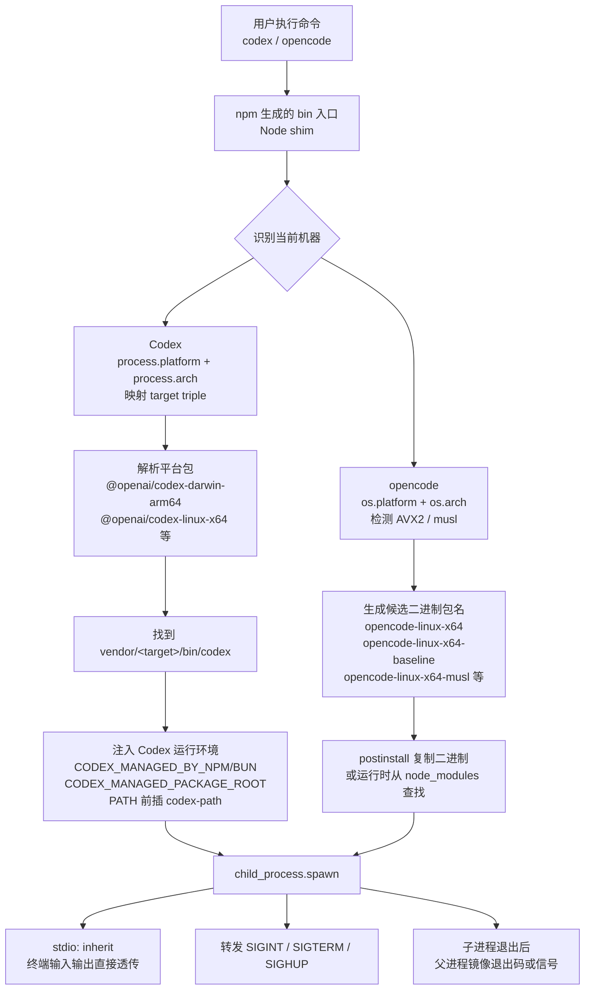

# 3. CLI 入口层：为什么用 Node shim 包原生二进制

## 问题

Codex 和 opencode 的底层核心分别是 Rust 和 TypeScript，但用户通过 npm 安装时，入口不是直接裸露一堆平台二进制，而是先经过一个 Node.js 脚本：`@openai/codex` 对应 `bin/codex.js`，opencode 当前 npm 包是 `opencode-ai`，入口脚本来自 `packages/opencode/bin/opencode`。

问题是：既然最后运行的都是原生二进制，为什么还要用 Node shim 包一层？

## 实际分层

两个项目的大方向一致：npm 包负责给用户提供稳定命令名，Node shim 负责找到当前机器能跑的二进制，真正的 CLI 主体再进入原生二进制。但细节不完全相同，尤其是 Codex 会在 shim 里注入安装来源和 PATH，opencode 则把更多选择逻辑放在 `postinstall` 与运行时查找里。

| 层         | Codex                           | opencode                                            |
| ---------- | ------------------------------- | --------------------------------------------------- |
| 入口 shim  | `bin/codex.js`（~240 行, Node） | `packages/opencode/bin/opencode`（~200 行, Node）   |
| 核心二进制 | Rust 编译产物 `codex`           | **TypeScript 通过 Bun compile** 编译产物 `opencode` |
| npm 包     | `@openai/codex`                 | `opencode-ai`                                       |

共同链路是：检测平台 → 找到对应的原生二进制 → `child_process.spawn` 启动 → 透传 stdin/stdout/stderr → 转发信号 → 镜像退出码。

## 启动流程



## shim 承担的职责

### 1. 多平台分发

npm 的 optional dependencies 机制让一个包名可以挂多种平台二进制。Codex 的 shim 里已经写死了 6 种 target triple 到平台包名的映射：

```
@openai/codex
├── @openai/codex-darwin-arm64    (Apple Silicon)
├── @openai/codex-darwin-x64      (Intel Mac)
├── @openai/codex-linux-x64       (x86 Linux)
├── @openai/codex-linux-arm64     (ARM Linux)
├── @openai/codex-win32-x64       (Windows)
└── @openai/codex-win32-arm64     (Windows ARM)
```

用户 `npm i -g @openai/codex` 后，shim 运行时通过 `process.platform` + `process.arch` 解析出对应的二进制路径。源码证据在 `codex/codex-cli/bin/codex.js`：先映射 target triple，再 `require.resolve("${platformPackage}/package.json")`，最后落到 `vendor/<target>/bin/codex`。

opencode 更进一步，在 x64 上还区分 **AVX2 / baseline**，在 Linux 上还区分 **musl / glibc**。`packages/opencode/bin/opencode` 和 `script/postinstall.mjs` 都有同一套选择逻辑：先检测 CPU 和 libc，再生成候选包名列表，优先选最匹配的二进制。

### 2. 信号转发与退出码透传

直接跑原生二进制也能用，但 Ctrl-C 处理会不干净。shim 做的事情：

```js
// 转发终止信号
["SIGINT", "SIGTERM", "SIGHUP"].forEach((sig) => {
  process.on(sig, () => child.kill(sig));
});

// 子进程退出后，镜像退出原因
child.on("exit", (code, signal) => {
  if (signal) process.kill(process.pid, signal);
  else process.exit(code ?? 1);
});
```

这让脚本化的使用场景（CI、管道、supervisor）能拿到正确的退出码和信号语义。

### 3. 包管理器感知

这是 Codex shim 明确承担的职责。它会检测安装时更像 npm 还是 bun，设置对应的环境变量：

```
CODEX_MANAGED_BY_NPM=1
CODEX_MANAGED_BY_BUN=1
CODEX_MANAGED_PACKAGE_ROOT=/path/to/global/node_modules/@openai/codex
```

原生二进制可以据此调整更新提示文案、日志路径等行为。

### 4. PATH 注入

这也是 Codex shim 明确承担的职责。它会把平台包里的 `codex-path` 目录前插到 `PATH`，让 Rust 侧在需要 `rg` 等辅助工具时，优先找到同包携带的版本。Rust 侧的 `codex-install-context` 也会识别这个 package layout，并在 `rg_command()` 里优先使用 `codex-path` 下的 `rg`。

opencode 当前 shim 没有同样的 PATH 注入逻辑。它的重点是选中并启动正确的 `opencode` 二进制。

## 为什么 npm 入口仍然有价值

两个项目都不只提供 npm。Codex 当前 README 里还有 `install.sh`、Homebrew 和 GitHub Releases；opencode README 里也有 curl install、brew、scoop、choco、pacman、AUR 等路径。更准确的问题不是“为什么只走 npm”，而是“为什么 npm 渠道还要保留 Node shim”。

| 因素          | 说明                                                    |
| ------------- | ------------------------------------------------------- |
| 开发者用户群  | 目标用户都已有 Node/npm，`npm i -g` 零心智负担          |
| 自动更新      | `npm update -g` 或 `npm i -g @latest`，不用自建更新管道 |
| optional deps | 天然解决多平台，不需要自己搞 S3 + checksum 下载脚本     |
| 生态整合      | IDE 插件、脚本、CI 和 JS 工具链更容易复用 npm 安装模型  |

所以 Node shim 的价值不是“用 JS 写 CLI”，而是把 npm 这个跨平台分发层和原生二进制这个执行层接起来。

## 对 mini-code-agent-cli 的启示

如果最终也走 **原生二进制 + JS shim** 模式：

- shim 负责分发、信号、环境检测，代码量 ~200 行
- 原生二进制负责重活：LLM 调用、代码执行、权限控制、TUI

如果做纯 JS/TS 版本，就不需要这层分离。opencode 分出来的原因是它的 TUI（Solid.js + OpenTUI）和 LLM 客户端通过 Bun compile 打包成单二进制文件，体积更小、不依赖 Node 运行时。Codex 用 Rust 则主要是为了安全性和编译后单二进制部署的简洁性。

当前阶段做原型时可以先用纯 Node，等验证了交互模式、确认哪些路径对性能敏感之后，再决定是否需要拆出原生层。
